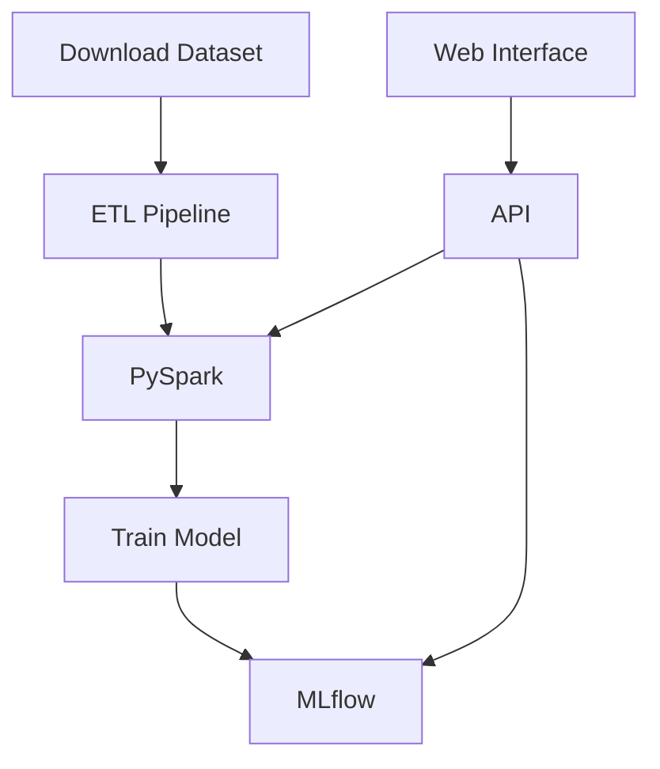

# Amazon Product Classifier

## Table of Contents

- [Amazon Product Classifier](#amazon-product-classifier)
  - [Table of Contents](#table-of-contents)
  - [Introduction](#introduction)
  - [Features](#features)
  - [Application Diagram](#application-diagram)
  - [Dataset](#dataset)
    - [Fields Explanation](#fields-explanation)
  - [Configuration](#configuration)
    - [ETL Configuration](#etl-configuration)
    - [Training Configuration](#training-configuration)
  - [Usage](#usage)
    - [Building Docker Images](#building-docker-images)
    - [Running the ETL Pipeline](#running-the-etl-pipeline)
    - [Training the Model](#training-the-model)
    - [Running the API and Web Interface](#running-the-api-and-web-interface)
  - [API Documentation](#api-documentation)
  - [Web Interface](#web-interface)
  - [File Structure](#file-structure)

---

## Introduction

This repository provides an end-to-end solution for classifying Amazon products (or any similar product dataset). It processes textual product data, trains a BERT-based model for classification, and serves predictions via a REST API and a Streamlit-based web interface. The workflow is integrated with MLflow for experiment tracking and model management.

## Features

- **ETL Pipeline**: Preprocesses large-scale datasets using PySpark.
- **Customizable Training**: Trains BERT models with configurable hyperparameters.
- **MLflow Integration**: Tracks experiments, metrics, and stores trained models.
- **REST API**: Serves predictions via a FastAPI application.
- **Web Interface**: Provides an intuitive web interface built with Streamlit.
- **Dockerized Workflow**: Supports containerized execution for reproducibility.

## Application Diagram

Below is a visual representation of the application's architecture:



## Dataset

The solution is designed to work with datasets similar to [Amazon Product Dataset](https://cseweb.ucsd.edu/~jmcauley/datasets/amazon_v2/). The dataset should be prepared as a JSONL file with appropriate fields for classification.

An example dataset configuration:

```yaml
etl_pipeline:
  input_path: "corpus.jsonl.gz"
  output_path: "./data/processed/corpus_bert_tiny.parquet/"
  data_fraction: 1.0
  seed: 7
  tokenizer_model: "prajjwal1/bert-tiny"
  label_column: "label"
  text_columns: ["title", "description", "feature", "brand"]

tokenizer:
  max_length: 512
```

### Fields Explanation
- **`input_path`**: Path to the input dataset.
- **`output_path`**: Destination for the processed data.
- **`data_fraction`**: Fraction of data to process (useful for sampling).
- **`seed`**: Seed for reproducibility.
- **`tokenizer_model`**: Hugging Face tokenizer to use.
- **`label_column`**: Column containing classification labels.
- **`text_columns`**: Columns used as input features for the model.
- **`max_length`**: Maximum token length for the tokenizer.

## Configuration

### ETL Configuration
The ETL configuration is defined in `src/data/configs`. Example:

```yaml
etl_pipeline:
  input_path: "corpus.jsonl.gz"
  output_path: "./data/processed/corpus_bert_tiny.parquet/"
  data_fraction: 1.0
  seed: 7
  tokenizer_model: "prajjwal1/bert-tiny"
  label_column: "label"
  text_columns: ["title", "description", "feature", "brand"]

tokenizer:
  max_length: 512
```

### Training Configuration
The training configuration is defined in `src/train/configs`. Example:

```yaml
input_data_path: 'data/processed/corpus_processed_bert_tiny.parquet'
input_data_encoded: True
data_load: 'distributed'
trainable_layers: None
bert_model_name: "prajjwal1/bert-tiny"
num_epochs: 1
batch_size: 256
test_batch_size: 256
learning_rate: 3e-4
optimizer: "AdamW"
device: "cuda"
seed: 7
data_fraction: 1
```

## Usage

### Building Docker Images

Build the training Docker image:

```bash
docker build --rm . -t amznclassif -f src/dockers/Dockerfile.train
```

### Running the ETL Pipeline

Run the ETL pipeline using Docker:

```bash
path=./
OPTS=( -it );
OPTS+=( -v $(realpath ${path}):/app );
docker run --gpus all --ipc=host "${OPTS[@]}" amznclassif bash etl_launch.sh
```

### Training the Model

Run the training pipeline using Docker:

```bash
path=./
OPTS=( -it );
OPTS+=( -v $(realpath ${path}):/app );
docker run --gpus all --ipc=host "${OPTS[@]}" amznclassif bash train_launch.sh
```

### Running the API and Web Interface

1. Update `src/api/config.yaml` with the appropriate `MLFLOW_RUN_ID`.
2. Start the API and web interface using Docker Compose:

```bash
cd src/dockers
docker-compose build
docker-compose up
```

## API Documentation

The API is documented using Swagger. Once the API is running, visit:

[http://127.0.0.1:8000/docs](http://127.0.0.1:8000/docs)

## Web Interface

Access the web interface at:

[http://0.0.0.0:8501](http://0.0.0.0:8501)

## File Structure

```plaintext
src/
├── api/
│   ├── app.py               # FastAPI application
│   ├── config.yaml          # API configuration
│   └── utils.py             # Helper functions for the API
├── data/
│   ├── etl.py               # ETL pipeline
│   ├── preprocessing.py     # Data preprocessing
│   └── utils.py             # Utility functions
├── dockers/
│   ├── Dockerfile.api       # Dockerfile for the API
│   ├── Dockerfile.train     # Dockerfile for training
│   ├── Dockerfile.web       # Dockerfile for the web interface
│   └── docker-compose.yaml  # Docker Compose configuration
├── train/
│   ├── configs/             # YAML configuration files for training
│   ├── datasets/            # Dataset management
│   ├── trainers/            # Training logic
│   └── pipeline.py          # Training pipeline
└── streamlit_app/
    ├── app.py               # Streamlit application
    └── logo.webp            # Logo for the web interface
```


---

*This repository was inspired by [https://github.com/vdevictor96/product-classifier](https://github.com/vdevictor96/product-classifier), especially the use of PySpark and a smaller version of the Amazon corpus.*
